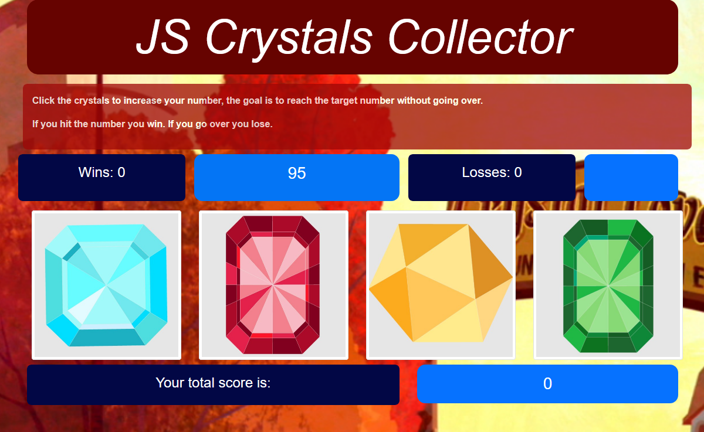

# jQuery Crystal Game


## Description

A Crystal Collector game using jquery & bootstrap. Four crystal images are displayed and the user must click them to increase their score attempting to reach a target goal. if they go over they lose.

## Installation

* git clone
```bash
git clone https://github.com/Vincent440/jquery-crystal-game.git
```
* cd into the directory

```bash
cd jquery-crystal-game
```

* Open up the `index.html` in your browser and start playing

## Usage 

You can [Play here](https://vincent440.github.io/Unit-4-game/) through github pages.

You will be given a random number at the start of the game

There are four crystals below. By clicking on a crystal you will add a specific amount of points to your total score.

You win the game by matching your total score to the random number,
you lose the game if your total score goes above the random number.

The value of each crystal is hidden from you until you click on it.

Each time when the game starts, the game will change the values of each crystal.

**jQuery Crystal Game**


## Credits

### Vincent Shury
*Full stack developer*
* [GitHub Profile](https://github.com/Vincent440)

* [Portfolio page](https://www.vshury.com/)

## License

[MIT](./license) License

---
2019 Vincent Shury
